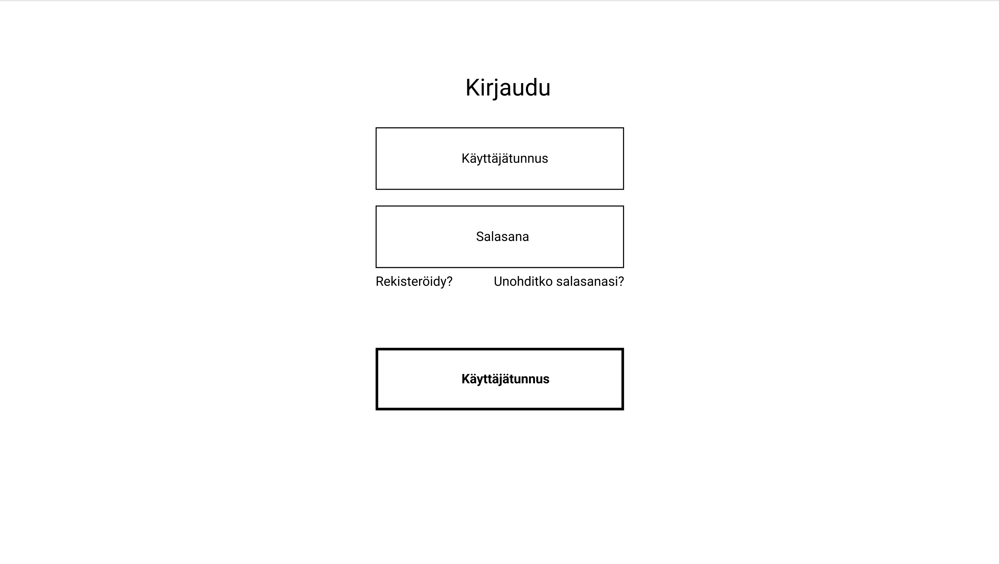
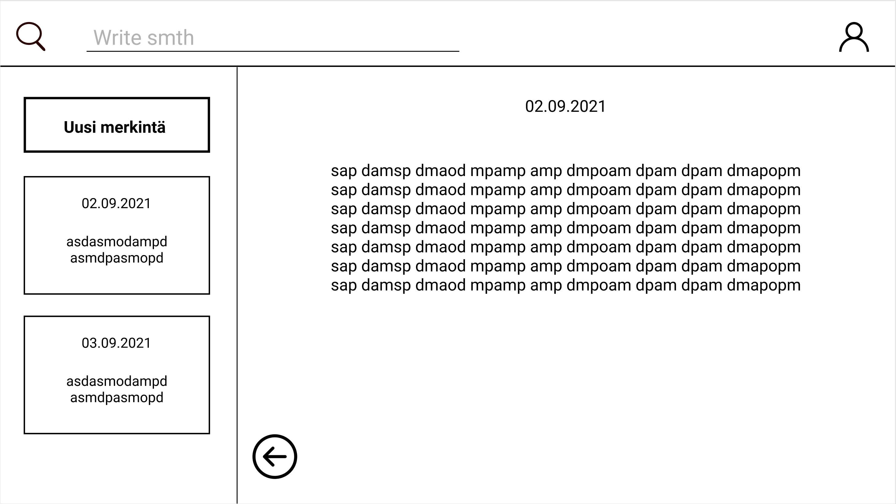
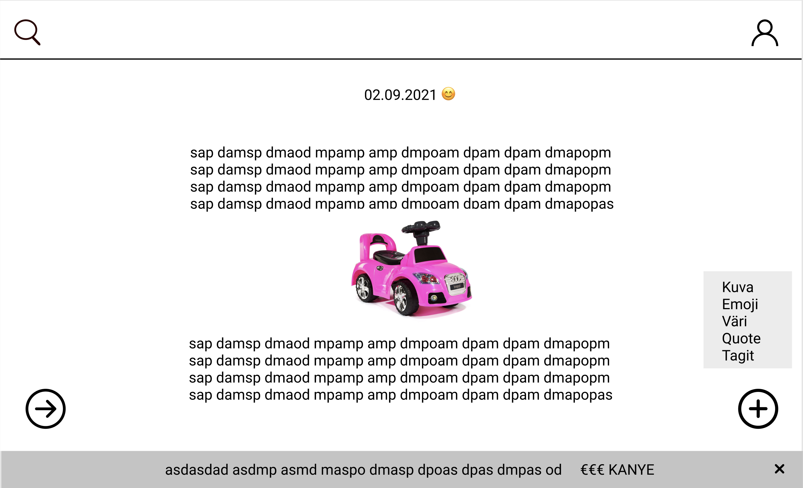
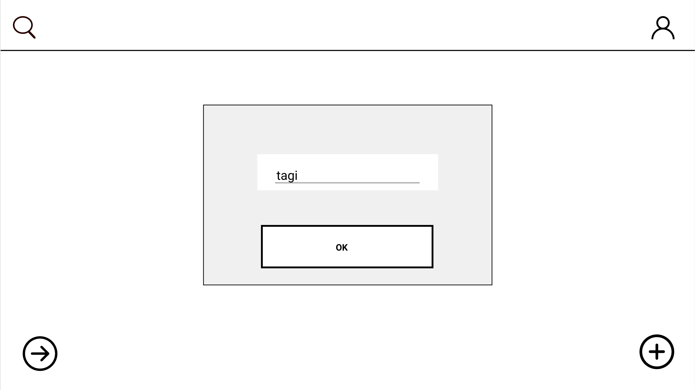
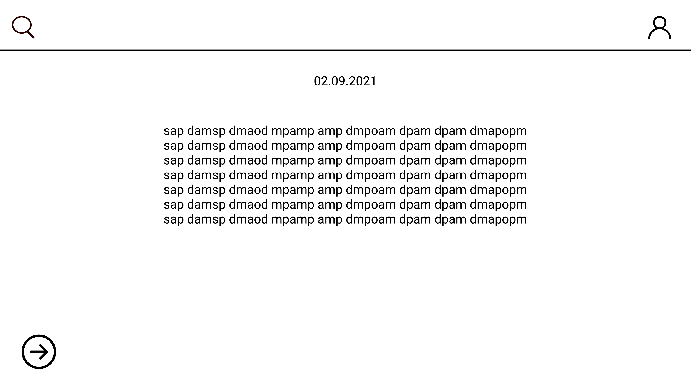
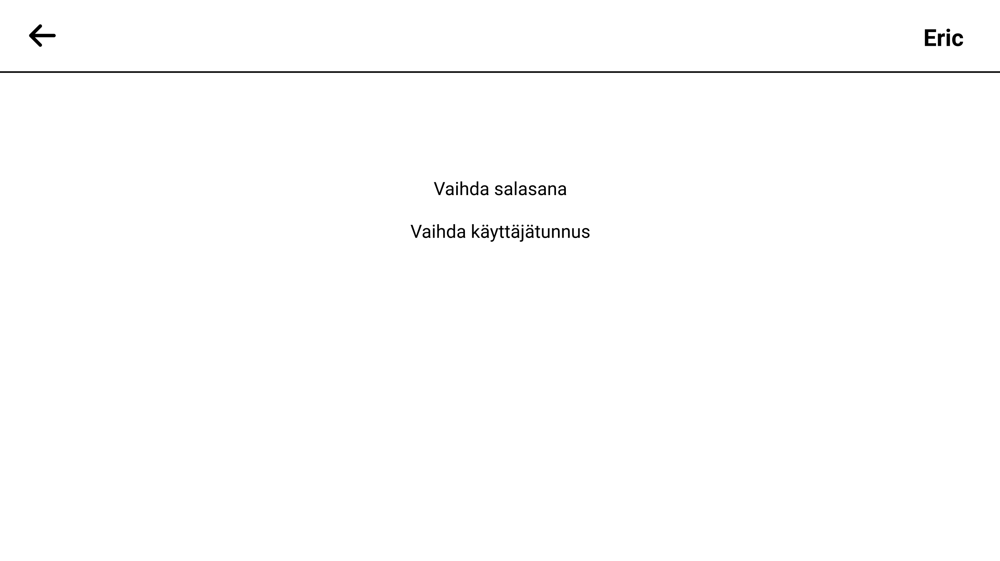

# 2021 Syksy, OTP R22, Päiväkirja
Ryhmän jäsenet: Timo Holopainen, Saku Ihalainen, Ruslan Potekhin, Aatu Pulkkinen
## Projektin visio

**Sovelluksesta yleisesti ja keskeisimmät tavoitteet.**

Tavoitteenamme on tuottaa sovellus ihmisille, jotka välittävät omasta hyvinvoinnistaan ja ovat kiinnostuneita dokumentoimaan elämäänsä, sekä sen hetkistä mielialaansa. Päiväkirjuri on applikaatio, jonka avulla käyttäjä voi tallentaa tapahtumia päiväkirjamaisesti, sekä liittää niihin hymynaamoilla merkittävän tunnetilan. Toisin kuin tavallisissa päiväkirja-sovelluksissa, meidän tuotteessamme tulee olemaan myös mahdollisuus valita päiväkirjamerkintään sen hetkistä tunnetilaa kuvastava väri.

**Käyttäjäryhmä**

Kaikenikäiset käyttäjät, joita kiinnostaa ylläpitää päiväkirjaa ja seurata mielialaansa samalla.

**Toteutettavia ominaisuuksia:**
Merkintöjen kirjoittaminen ja säilöminen

Käyttäjän luominen

Tägihaku

Päivämäärän ja kellonajan liittäminen merkintään

Kuvien liittäminen päiväkirjamerkintään

Tunnetilaa kuvaava hymynaama ja päiväkirjamerkinnän väri 

Daily quote merkinnän yhteyteen

(Koneoppiminen millä ennustetaan tulevien päivien fiilistä. Tämä jos jää aikaa ja osaamista)

**Kuka, mitä, miksi:**

Käyttäjälle luodaan tunnus jonka takaa löytyy päiväkirjaan tehdyt merkinnät. Merkintöihin on liitettynä päivämäärä ja kellonaika. Halutessaan käyttäjä voi lisätä merkintöihin myös kuvia, tunnetilaa kuvaavan hymiön tai surunaaman sekä myös värittää merkinnän tunnetilan mukaisella värillä. Merkintöihin voi myös liittää “daily quoten”, joka pyritään hakemaan ohjelmaan netistä. Vanhoja merkintöjä voi myös hakea hakusanoilla, jotka asetetaan merkintään sitä luodessa.

Ohjelmaa voi käyttää kuka tahansa joka haluaa pitää kirjaa päivän tekemisistä. Tehdyt merkinnät ovat haettavissa myöhemmin ja näin käyttäjä kykenee päiväkirjasta tarkastamaan päivien tapahtumia, ideoita ja oivalluksia.

## Kuvia käyttöliittymän prototyypistä

